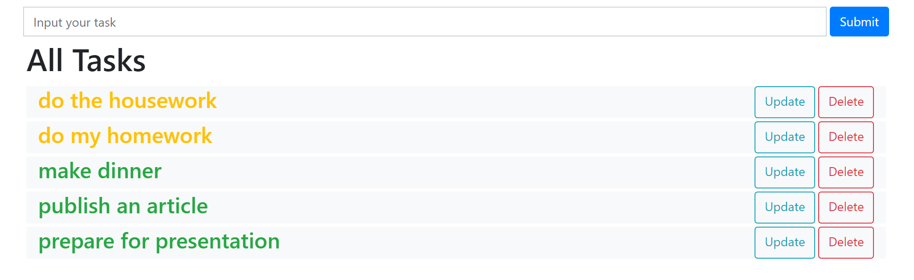

# To Do App

This is a simple version of To Do App. It is made with Python, Django. Styling is made with Bootstrap. The application allows to create a quick list of tasks with minimum options:
* Create task
* Update task
* Delete task
* Mark them as "complete"

A green task means a complete task. A yellow task shows that the task is not complete.  
